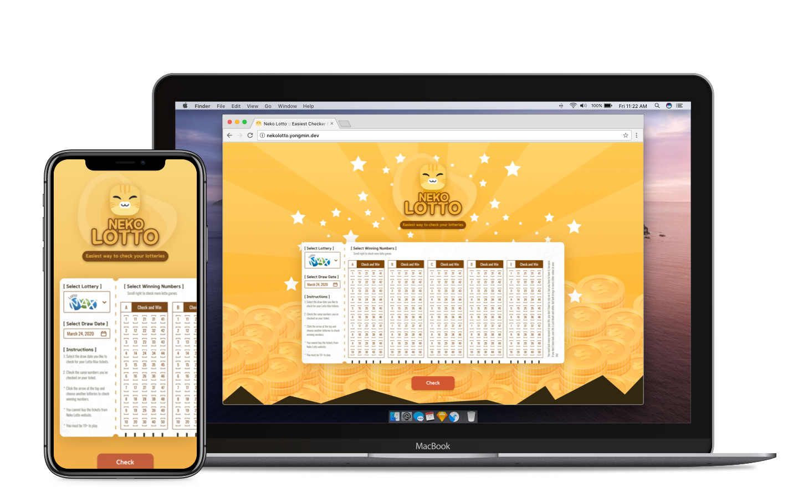
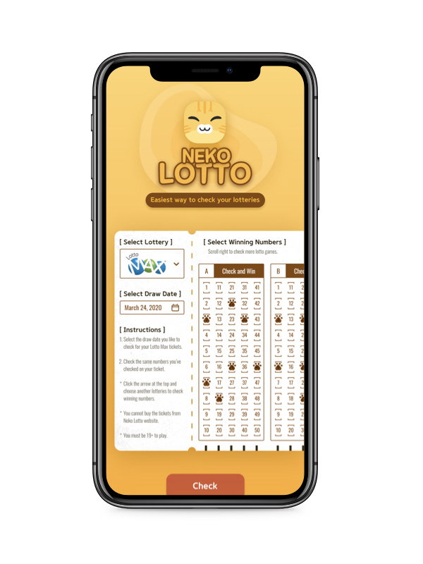

# Neko Lotto :smiley_cat:

React/React Native web/mobile application with TypeScript to manage Canadian Lotteries.

> Lotto Max is available to check for now.

## Table of contents

[1. Web application](#web-application)

&nbsp;&nbsp;&nbsp;&nbsp;[- Date picker](#--date-picker)

&nbsp;&nbsp;&nbsp;&nbsp;[- Lottery ticket checker](#--lottery-ticket-checker)

&nbsp;&nbsp;&nbsp;&nbsp;[- One button modal box](#--one-button-modal-box)

&nbsp;&nbsp;&nbsp;&nbsp;[- Loading context](#--loading-context)

&nbsp;&nbsp;&nbsp;&nbsp;[- Game result screen](#--game-result-screen)

[2. Mobile application](#--mobile-application)

&nbsp;

&nbsp;

## Web application

### Features

#### - Date picker

---

#### - Lottery ticket checker

---

#### - One button modal box

---

#### - Loading context

---

#### - Game result screen

